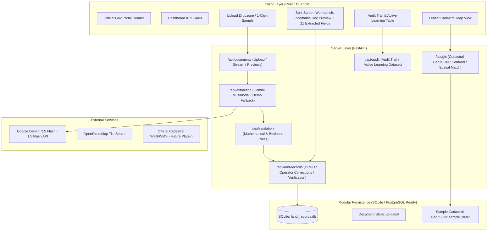

# Intelligent Land Record Digitization and Validation System
### Smart India Hackathon (SIH) 2026 Prototype • Problem Statement 26018

[](https://fastapi.tiangolo.com/)
[](https://react.dev/)
[](https://aistudio.google.com/)
[](https://leafletjs.com/)

---

## Table of Contents
1. [Problem Statement (PS 26018)](#problem-statement-ps-26018)
2. [Proposed Solution & Overview](#proposed-solution--overview)
3. [System Architecture](#system-architecture)
4. [Tech Stack](#tech-stack)
5. [Key Innovations & Features](#key-innovations--features)
6. [Repository Structure](#repository-structure)
7. [Getting Started & Setup Instructions](#getting-started--setup-instructions)
   - [Prerequisites](#prerequisites)
   - [Backend Setup (FastAPI)](#backend-setup-fastapi)
   - [Frontend Setup (React + Vite)](#frontend-setup-react--vite)
   - [Configuring Google Gemini API](#configuring-google-gemini-api)
8. [Demo Mode & Evaluator Guide](#demo-mode--evaluator-guide)
9. [Cadastral GIS Mapping & Polygons](#cadastral-gis-mapping--polygons)
10. [REST API Documentation](#rest-api-documentation)
11. [Known Limitations & Future Scope](#known-limitations--future-scope)

---

## Problem Statement (PS 26018)
**"Intelligent Land Record Digitization and Validation System"**

Traditional land records in India (such as Maharashtra Form 7/12 - Saat-Baara extracts, Khasra, and Khatauni registers) exist as scanned, handwritten, or aged physical copies in regional languages (Devanagari/Marathi, Hindi, Gujarati, etc.). Manual digitization suffers from:
- Slow data entry and high clerical errors.
- Unnoticed mathematical discrepancies (e.g. sum of Pot Kharab uncultivable area and Jirayat rainfed area not matching the total recorded parcel area).
- Disconnection between tabular revenue registries and spatial cadastral maps.
- Lack of human-in-the-loop validation and audit tracking.

---

## Proposed Solution & Overview
This system provides an end-to-end intelligent revenue digitization workbench for Revenue Officers (Talathis / Tahsildars):
1. **Multimodal Document Understanding**: Leverages Google Gemini multimodal vision AI to analyze scanned PDFs and high-resolution images in Marathi (Devanagari) and English without needing brittle, custom OCR training for the rapid prototype.
2. **21 Structured Land Record Fields**: Extracts owners, co-owners, Gat/Survey numbers, village/tehsil/district, area breakdowns, land classifications, mutation numbers, and registration notes.
3. **Granular Confidence Scoring**: Provides a 0–100 confidence score for every extracted field:
   - **High (≥ 90%)**: Green
   - **Medium (80–89%)**: Amber
   - **Needs Verification (< 80%)**: Red/Orange highlight with explicit operator verification prompts.
4. **Automated Business & Math Validation**: Detects area component sum mismatches (`pot_kharab_area + jirayat_area != total_area`), negative values, missing mandatory attributes, and village duplicate Gat numbers.
5. **Human-in-the-Loop & Active Learning**: Allows operators to review, edit, and verify fields. Corrections are tracked in an immutable audit trail and persisted to an `Active Learning Dataset` table for future model fine-tuning.
6. **Cadastral GIS Integration**: Interactive OpenStreetMap / Leaflet cadastral viewer with GeoJSON parcel boundaries (Gat 141 to 145) with plot zoom, boundary highlighting, and bidirectional navigation between maps and records.
7. **Official Government Aesthetic**: Built strictly following National Informatics Centre (NIC) and Digital India portal standards (clean light palette, deep navy `#0a3d62`, crisp typography, and no distracting neon/dark mode).

---

## System Architecture



---

## Tech Stack

| Layer | Technologies Used |
|---|---|
| **Frontend** | React 19, Vite, Vanilla CSS (Government Design System), Leaflet, Lucide React |
| **Backend** | Python 3.13, FastAPI, Uvicorn, Pydantic v2, SQLAlchemy ORM |
| **AI / Document Understanding** | Google Gemini Multimodal API (`google-genai` SDK), engineered bilingual prompts |
| **Cadastral GIS** | Leaflet.js, OpenStreetMap Carto tiles, GeoJSON cadastral parcel boundaries |
| **Database** | SQLite (modular design, cleanly swappable with PostgreSQL/PostGIS) |
| **Storage & Testing** | Python-multipart, Pillow, TestClient, PyPDF |

---

## Key Innovations & Features

### 1. Split-Screen Verification Workbench
- **Left Panel**: High-resolution document viewer with pan, scroll, and zoom controls (60% to 220%, reset to 100%), supporting both PDF and image formats.
- **Right Panel**: 21 extracted fields grouped into 4 logical revenue sections:
  1. *Parcel Identification* (Gat, Survey, Khasra, Khata, Village, Tehsil, District, State)
  2. *Ownership Details* (Primary Owner, Co-owners, Tenure Class)
  3. *Area Breakdown & Classification* (Total Area, Cultivated, Pot Kharab, Jirayat, Classification)
  4. *Mutation & Registration* (Ferfar No., Mutation Date, Reg. No., Reg. Date, Remarks)

### 2. Discrepancy & Mathematical Validation Engine
- Verifies `pot_kharab_area + jirayat_area == total_area`.
- If a discrepancy exists (e.g. 0.20 Ha Pot Kharab + 0.75 Ha Jirayat = 0.95 Ha != 1.00 Ha Total Area), a prominent warning alert is displayed explaining the exact numerical difference.
- Validates non-negative values and completeness of mandatory fields.

### 3. Human-in-the-Loop & Active Learning Dataset
- Fields with confidence `< 80%` are automatically tagged with a yellow/red warning: `"Human Verification Required"`.
- Officers can click **"Edit"**, update the value, and save.
- Each edit updates field status to `"Corrected by Operator"`, writes to the immutable `audit_logs` table, and logs the `(Original AI Value, Ground Truth Value, Confidence)` pair to the `active_learning_dataset` table.

### 4. Interactive Cadastral GIS Linking
- Highlights the target parcel polygon (e.g. Gat 142) on OpenStreetMap.
- Clicking any polygon in the village cluster displays its attributes (Gat No, Owner, Area, Village) with a **"View Land Record"** button that navigates directly to the record's split-screen workbench.

---

## Repository Structure

```
.
├── backend/
│   ├── .env                       # Backend configuration (GEMINI_API_KEY, DEMO_MODE)
│   ├── .env.example               # Example template for environment variables
│   ├── requirements.txt           # Python backend dependencies
│   ├── test_backend.py            # Integration test suite for backend APIs
│   ├── land_records.db            # SQLite database file
│   ├── app/
│   │   ├── __init__.py
│   │   ├── config.py              # Settings & environment parser
│   │   ├── database.py            # SQLAlchemy engine and session dependency
│   │   ├── main.py                # FastAPI entry point, CORS, seeding & static mounts
│   │   ├── models/
│   │   │   ├── __init__.py
│   │   │   └── entities.py        # Relational models (Document, LandRecord, Field, Audit, GIS)
│   │   ├── services/
│   │   │   ├── __init__.py
│   │   │   ├── gemini_service.py  # Gemini Multimodal extraction & prompt engineering
│   │   │   ├── validation_service.py # Business & mathematical validation rules
│   │   │   └── gis_service.py     # Cadastral GeoJSON parser and spatial lookup
│   │   └── routers/
│   │       ├── __init__.py
│   │       ├── documents.py       # Upload, list, preview endpoints
│   │       ├── extraction.py      # AI trigger & extraction retrieval
│   │       ├── land_records.py    # Field updates & verification sealing
│   │       ├── validation.py      # Discrepancy checks & rule re-evaluation
│   │       ├── gis.py             # Cadastral GeoJSON and plot lookup
│   │       ├── dashboard.py       # KPI statistics and recent records
│   │       └── audit.py           # Audit log trail & active learning dataset
│   ├── sample_data/
│   │   ├── sample_7_12.png        # Realistic Maharashtra 7/12 document with Marathi text & stamp
│   │   ├── demo_extracted_record.json # Pre-configured accurate extracted JSON for demo
│   │   └── cadastral_parcels.geojson # Realistic cadastral parcel polygons (Gat 141-145)
│   ├── scripts/
│   │   └── generate_sample_712.py # Pillow script to generate high-resolution 7/12 document
│   └── uploads/                   # Uploaded document storage
│
├── frontend/
│   ├── package.json               # React, Vite, Leaflet, Lucide-React dependencies
│   ├── vite.config.js             # Vite configuration
│   ├── index.html                 # Entry HTML with Leaflet CSS and SEO tags
│   └── src/
│       ├── main.jsx               # React DOM entry
│       ├── App.jsx                # Main application state and page switcher
│       ├── api.js                 # Centralized API service client for FastAPI backend
│       ├── index.css              # Government portal design system & responsive layout
│       ├── components/
│       │   └── Header.jsx         # Indian Government header, national ribbon, nav & badges
│       └── pages/
│           ├── Login.jsx          # Official login portal with 1-click demo auth
│           ├── Dashboard.jsx      # KPI metric cards and recent records queue
│           ├── Upload.jsx         # Drag-and-drop document upload & 1-click sample button
│           ├── Verification.jsx   # MAIN SCREEN: Split-screen document viewer & field editor
│           ├── MapView.jsx        # Leaflet cadastral map with polygon highlights & popups
│           └── AuditTrail.jsx     # Chronological audit log & active learning dataset table
└── README.md
```

---

## Getting Started & Setup Instructions

### Prerequisites
- **Python**: Version 3.11+ (Python 3.13 tested)
- **Node.js**: Version 18+ (Node 24 tested)
- **npm**: Version 9+

---

### Backend Setup (FastAPI)

1. Open a terminal and navigate to `backend/`:
   ```bash
   cd backend
   ```

2. (Optional) Create and activate a Python virtual environment:
   ```bash
   python -m venv venv
   # On Windows:
   .\venv\Scripts\activate
   # On Linux/macOS:
   source venv/bin/activate
   ```

3. Install required packages:
   ```bash
   pip install -r requirements.txt
   ```

4. Start the FastAPI backend server:
   ```bash
   python -m uvicorn app.main:app --host 127.0.0.1 --port 8000 --reload
   ```
   *The backend will be live at `http://127.0.0.1:8000` with interactive API docs at `http://127.0.0.1:8000/docs`.*

---

### Frontend Setup (React + Vite)

1. Open a second terminal and navigate to `frontend/`:
   ```bash
   cd frontend
   ```

2. Install npm dependencies:
   ```bash
   npm install
   ```

3. Start the Vite dev server:
   ```bash
   npm run dev -- --host 127.0.0.1 --port 5173
   ```
   *The portal will be live at `http://127.0.0.1:5173`.*

---

### Configuring Google Gemini API

> [!NOTE]
> **Gemini Security**: The Gemini API key is **never exposed** to the frontend client. The React app interacts exclusively with the FastAPI backend.

1. Get a Gemini API key from [Google AI Studio](https://aistudio.google.com/).
2. Open `backend/.env` and insert your key:
   ```env
   GEMINI_API_KEY=AIzaSy...your_real_key_here
   DEMO_MODE=False
   ```
3. Restart the backend server. Uploaded PDFs or images will now be processed directly through Google Gemini's multimodal API (`gemini-2.5-flash`).
4. If no API key is provided or if `DEMO_MODE=True`, the system automatically falls back to high-fidelity demo extraction so evaluators can test the complete system offline without any API credentials.

---

## Demo Mode & Evaluator Guide

Follow this 2-minute walkthrough to evaluate all features:

1. **Sign In**: Navigate to `http://127.0.0.1:5173/`. Demo Officer credentials (`officer_pune`) are pre-filled. Click **"Authenticate & Sign In"**.
2. **Dashboard Overview**: View live KPI cards (*Documents Processed, Successfully Verified, Pending Verification, Validation Discrepancies*). Notice the recent documents table.
3. **Instant 1-Click Evaluation**:
   - In the top action bar or from the **"Upload Land Record"** tab, click **"Try 1-Click Sample 7/12"**.
   - This instantly provisions an authentic Maharashtra 7/12 document with Devanagari script, revenue stamp, and area discrepancy for Gat 142 (Khed, Pune) and directs you into the verification screen.
4. **Split-Screen Verification**:
   - **Left**: Observe the high-resolution scanned 7/12 document with zoom controls (Zoom In, Zoom Out, Reset).
   - **Right**: Inspect the 21 extracted fields. Notice the confidence color indicators (Green ≥90%, Amber 80–89%, Red/Orange <80%).
   - **Discrepancy Banner**: Read the highlighted discrepancy alert: *Pot Kharab (0.20 Ha) + Jirayat (0.75 Ha) = 0.95 Ha, which differs from Total Area (1.00 Ha).*
5. **Human-in-the-Loop Correction**:
   - Locate the **"Total Area"** field.
   - Click **"Edit"**, change `1.00` to `0.95`, and click the checkmark to save.
   - Notice the status updates to `"Corrected by Operator"` and the mathematical validation automatically reconciles!
6. **Official Approval**:
   - Click **"Verify & Save Record"**. The record is sealed with officer name and timestamp.
7. **Locate on Cadastral Map**:
   - Click the prominent **"Locate on Map"** button.
   - The map centers on Gat 142 in Khed, Pune.
   - Gat 142 is highlighted with an orange/red polygon.
   - The right-hand panel displays the plot summary with an active **"View Land Record"** button.
8. **Audit Trail & Active Learning**:
   - Click **"Audit Trail & Active Learning"** in the navigation bar.
   - Switch to the **"Active Learning Dataset"** tab to see your manual correction saved as ground-truth training data.

---

## Cadastral GIS Mapping & Polygons

> [!IMPORTANT]
> **Separation of Sample & Real Government GIS Data**:
> This prototype uses sample cadastral GeoJSON polygons for Gat 141 to 145 in Khed, Pune to showcase interactive spatial linking.
> The GIS layer is decoupled behind `app/services/gis_service.py` (`CadastralGISProvider`). To connect to official state GIS servers (such as Maharashtra Mahabhunaksha / BhuNaksha), replace `_load_data()` with an HTTP client requesting standard OGC WFS / GeoJSON layers.

---

## REST API Documentation

FastAPI provides automated Swagger UI documentation at `http://127.0.0.1:8000/docs`. Key endpoints include:

| Method | Endpoint | Description |
|---|---|---|
| `GET` | `/api/health` | System health, version, and Gemini configuration status |
| `GET` | `/api/dashboard/stats` | KPI statistics (Processed, Verified, Pending, Issues) |
| `GET` | `/api/dashboard/recent` | Recent processed documents queue |
| `POST` | `/api/documents/upload` | Multipart file upload (PDF, JPG, PNG) |
| `POST` | `/api/documents/load-sample` | 1-click loading of sample 7/12 document |
| `GET` | `/api/documents/{id}/file` | Streams raw file for split-screen preview |
| `POST` | `/api/extraction/process/{id}` | Triggers Gemini Multimodal AI extraction |
| `GET` | `/api/extraction/{id}` | Fetches extracted 21 fields and validation results |
| `PUT` | `/api/land-records/{id}/field` | Operator inline edit; logs to active learning |
| `POST` | `/api/land-records/{id}/verify` | Official verification seal |
| `GET` | `/api/gis/parcels` | Returns cadastral GeoJSON FeatureCollection |
| `GET` | `/api/gis/locate?gat_number=142` | Locates plot polygon and computes centroid |
| `GET` | `/api/audit` | Chronological system audit trail |
| `GET` | `/api/audit/active-learning` | Export ground-truth operator corrections |

---

## Known Limitations & Future Scope

### Known Prototype Limitations
- **Sample GIS Boundaries**: The prototype currently displays sample GeoJSON polygons for Gat 141 to 145 in Khed, Pune rather than live state-wide GIS server integration.
- **Mock Authentication**: Uses mock Revenue Officer authentication rather than SSO/OAuth via Government DigiLocker or Jan Parichay.
- **Single Page Document Preview**: Multi-page PDF preview utilizes standard browser PDF rendering; page-by-page bounding box annotation overlay is simulated.

### Recommended Next Improvements (SIH Finalists Phase)
1. **Live Mahabhunaksha / BhuNaksha API Integration**: Plug in official state WFS/WMS geospatial endpoints into `gis_service.py`.
2. **Active Learning LoRA Fine-Tuning**: Implement an automated pipeline that takes records in the `active_learning_dataset` table and fine-tunes domain-specific vision-language models.
3. **Automated Bounding Box Visual Overlays**: Render interactive bounding boxes directly on the document image canvas corresponding to each field.
4. **PostgreSQL / PostGIS Migration**: Point `DATABASE_URL` to PostgreSQL with PostGIS for spatial spatial indexing (`ST_Contains`, `ST_Intersects`).
5. **Government DigiLocker / Jan Parichay Integration**: Official SSO authentication for revenue officers and citizens.
